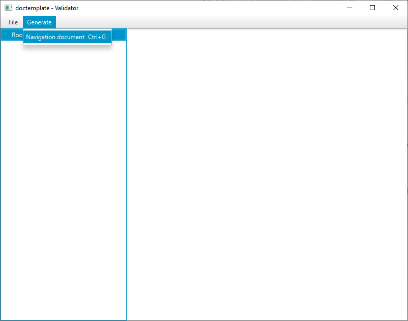

# doctemplate - Validator

The doctemplate Validator is a tool for validating and navigating through an RTF doctemplate

## Usage

### cli
You can either run the application in **gui** (which is default) or run the application with the argument ``--no-gui``
and  by passing the path to the file.

e.g.
````shell script
java -jar validator.jar --no-gui C:/Users/user/Documents/document.rtf
````

### GUI

#### Open doctemplate file
Opens a doctemplate RTF file and shows and validates the structure of the document


#### Generate navigation document
This feature generates a RTF based navigation document which you can use to navigate in a doctemplate
